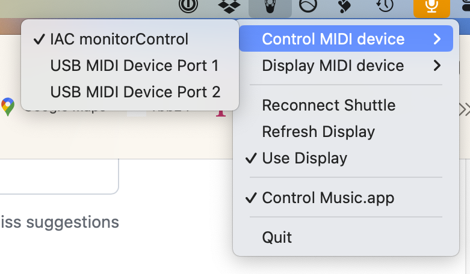
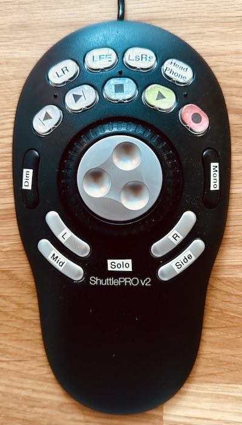

# ShuttleMidi
ShuttleMidi is a small programm which sits in the MacOS sys tray and translates the button press from a ContourDesign ShuttleProV2 into MIDI CC messages.

I used code from https://github.com/dg1psi/shuttlemidi but changed it to suit my needs.

As you can see on the pic below I use it as my audio monitor controller in conjuction with Reaper.

